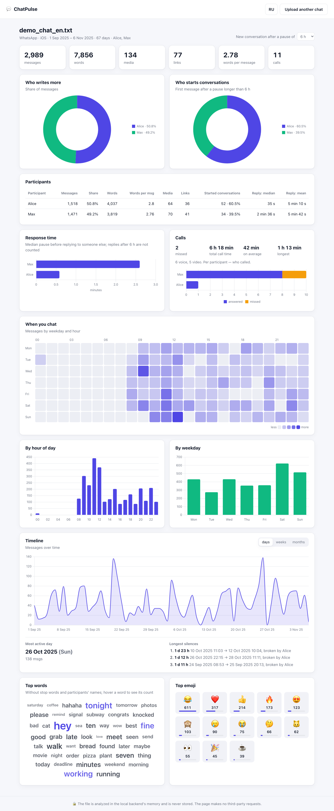
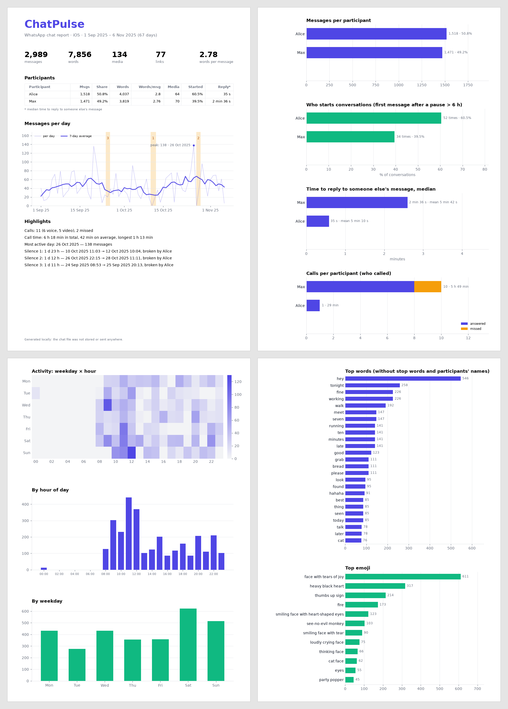

# 💬 ChatPulse

A local, private analyzer for WhatsApp chat exports. Drop in the `.txt` (or the `.zip`
you get when exporting *with media*) and get a dashboard: who writes more, who starts
conversations, how fast people reply, when the chat is alive, calls, silences, top words
and emoji.

**Nothing is stored.** The file is parsed in memory and dropped as soon as the response
is sent — it never touches the server's disk, and it never leaves your machine.



<sub>The screenshot uses [`examples/demo_chat_en.txt`](examples/demo_chat_en.txt) — a synthetic
chat with made-up people and messages. The interface is available in English and Russian.</sub>

## Features

| | |
|---|---|
| **Upload** | drag-and-drop `.txt` or `.zip`; for a zip only the chat `.txt` is read, media is ignored |
| **Parser** | Android and iOS formats, detected from the file itself; 12/24-hour clocks; day/month order inferred from all dates in the file; multi-line messages; system events, media, deleted messages, calls |
| **Overview** | messages, words, media, links, average words per message |
| **Participants** | message count and share; who starts a conversation after a pause > 6 h |
| **Response time** | median and mean time each person takes to reply to someone else |
| **Calls** | voice/video, missed, total and average duration, per caller |
| **Activity** | weekday × hour heatmap, messages by hour and by weekday |
| **Timeline** | messages per day/week/month, the most active day, the 3 longest silences |
| **Top words** | word cloud without Russian/English stop words and participants' names |
| **Top emoji** | skin tones, flags and ZWJ sequences (👨‍👩‍👧) are counted as one emoji |
| **CLI** | the same analysis from the terminal, with a PDF report — no Docker, no frontend |
| **Languages** | English and Russian: the EN/RU button in the header or `?lang=en` in the URL; `--lang en` for the CLI and PDF |

Messy exports get clear empty states instead of errors — both in the web UI and in the CLI:
no calls, a single participant, only system messages, an empty or non-WhatsApp file.

## Quick start (Docker)

```bash
docker compose up --build
```

Open http://localhost:5173 and drop your export — or open
http://localhost:5173/?demo&lang=en to see the dashboard on the synthetic demo chat in
English. The API docs are at http://localhost:8000/api/docs.

## Running without Docker

Backend (Python 3.11+; tested on 3.14):

```bash
cd backend
python3 -m venv .venv && source .venv/bin/activate
pip install -r requirements-dev.txt
uvicorn app.main:app --reload          # http://localhost:8000
```

Frontend (Node 20.19+ or 22.12+), in a second terminal:

```bash
cd frontend
npm install
npm run dev                            # http://localhost:5173
```

The frontend calls `http://localhost:8000` by default; change it with
`VITE_API_URL=http://host:port npm run dev`. The backend accepts CORS requests only from
`http://localhost:5173` (override with `CHATPULSE_CORS_ORIGINS`).

## CLI: a PDF report from the terminal

`report_cli.py` uses exactly the same `analyzer_core` code as the API and builds its charts
from the same JSON report the frontend receives.

```bash
cd backend
python report_cli.py chat.txt --out report.pdf
python report_cli.py "WhatsApp Chat.zip" --json report.json --no-pdf
python report_cli.py ../examples/demo_chat_en.txt --lang en --gap-hours 3
```

| Flag | Meaning |
|---|---|
| `--out PATH` | where to save the PDF (default: `<chat name>_report.pdf`) |
| `--json PATH` | also save the report as JSON — the same format the API returns |
| `--no-pdf` | only print the summary in the terminal |
| `--gap-hours H` | pause after which a new conversation starts (default 6) |
| `--top-words N` | how many words to keep in the top (default 50) |
| `--lang ru\|en` | language of the terminal summary and the PDF (default `ru`) |

The PDF has four pages: an overview with the timeline, participants and response times,
activity heatmap, top words and emoji.



## How to export a chat from WhatsApp

- **Android:** open the chat → ⋮ → More → Export chat → Without media.
- **iPhone:** open the chat → tap the contact or group name → Export Chat → Without Media.

Exporting *with media* also works: ChatPulse opens the `.zip`, takes the chat `.txt` and
ignores photos and videos. It is just much bigger to upload (the limit is 200 MB,
configurable with `CHATPULSE_MAX_UPLOAD_MB`).

## Privacy

- **No storage.** There is no database and no file storage. The report is computed and
  returned in one request.
- **Never on disk.** FastAPI's usual `UploadFile` is backed by a `SpooledTemporaryFile`
  that moves uploads larger than 1 MB into a temporary file on disk. ChatPulse parses the
  multipart body itself with a spool threshold above the upload limit, so the file stays
  in memory. `tests/test_api.py::test_upload_never_touches_disk` fails if a 3 MB upload
  ever rolls over to disk.
- **Read-only container.** In Docker the backend runs with a read-only filesystem, so there
  is physically nowhere to write the chat to.
- **Local only.** Docker publishes ports on `127.0.0.1` only; CORS allows only the local
  frontend. The frontend loads no external fonts, scripts or analytics.
- The browser keeps the selected file in the tab's memory so you can re-run the analysis
  with a different pause; closing the tab discards it.

## How the metrics are defined

- **Message** — a text, media or deleted message from a participant. Calls and system
  events (encryption notice, "X added Y", subject changes) are counted separately.
- **Word** — a run of letters (any alphabet). Links, numbers and emoji are not words.
- **Conversation start** — the first message after more than `gap_hours` (6 by default)
  of silence. Its author is the one who *initiated* the conversation.
- **Response time** — the pause before a message whose previous message was written by
  someone else, measured from that person's *last* message. Replies after more than
  `gap_hours` are treated as new conversations, not as slow replies, so they don't skew
  the mean.
- **Silence** — a gap between two consecutive messages; the report lists the three longest
  and who broke each one.
- **Calls** — the author of a call line is the caller (for a missed call — the person whose
  call was missed). Calls are counted only when the export contains them.

Android exports store time without seconds, so there response times are accurate to a
minute — the report says so in a warning.

## API

| Method | Path | Description |
|---|---|---|
| `POST` | `/api/analyze?gap_hours=6&lang=en` | `multipart/form-data` with the file in the `file` field → JSON report |
| `GET` | `/api/health` | health check (used by docker-compose) |

```bash
curl -F "file=@examples/demo_chat_en.txt" "http://localhost:8000/api/analyze?lang=en"
```

Errors come back as `{"detail": "..."}` with a message that can be shown to the user, in the
language from `lang` (`ru` by default): `422` — the file is empty or is not a WhatsApp export,
`413` — too large, `415` — not a multipart request, `400` — no `file` field.

The report itself doesn't depend on `lang`: warnings are codes (`no_messages`,
`single_participant`, `no_seconds`), and each client shows them in its own language.

The report for the English demo chat, shortened:

```jsonc
{
  "meta": {"platform": "ios", "date_order": "MDY", "participants": ["Alice", "Max"],
           "first_message": "2025-09-01T18:11:50", "days": 67, "has_seconds": true, "gap_hours": 6.0},
  "summary": {"messages": 2989, "words": 7856, "media": 134, "links": 77, "deleted": 28,
              "avg_words_per_message": 2.78},
  "participants": [{"name": "Alice", "messages": 1518, "share": 50.8, "words": 4037,
                    "initiations": 52, "initiation_share": 60.5 /* … */} /* , … */],
  "response_times": [{"name": "Max", "median_s": 156.0, "mean_s": 342.1, "responses": 794} /* , … */],
  "calls": {"total": 11, "completed": 9, "missed": 2, "total_duration_s": 22680.0,
            "by_participant": [/* total, completed, missed, duration per caller */]},
  "activity": {"matrix": [/* 7 rows (Monday first) × 24 hours */], "by_hour": [/* 24 */], "by_weekday": [/* 7 */]},
  "timeline": {"dates": ["2025-09-01" /* , … every day, including empty ones */], "counts": [/* … */],
               "most_active_day": {"date": "2025-10-26", "count": 138},
               "longest_silences": [{"start": "2025-10-10T11:03:03", "end": "2025-10-12T10:04:36",
                                     "duration_s": 169293.0, "broken_by": "Alice"} /* , … top 3 */]},
  "top_words": [{"word": "hey", "count": 546} /* , … top 50 */],
  "top_emoji": [{"emoji": "😂", "count": 611} /* , … top 20 */],
  "warnings": [/* codes, e.g. "no_seconds" */]
}
```

## Project structure

```
chatpulse/
├── backend/
│   ├── analyzer_core/          # reusable package: all the logic, no web
│   │   ├── parser.py           # format detection + parsing into a pandas DataFrame
│   │   ├── metrics.py          # every aggregation + analyze() → the JSON report
│   │   ├── messages.py         # error and warning texts in Russian and English
│   │   └── stopwords/          # ru.txt, en.txt
│   ├── app/main.py             # FastAPI: POST /api/analyze, GET /api/health
│   ├── report_cli.py           # terminal entry point, PDF via matplotlib
│   ├── scripts/make_demo_chat.py  # synthetic chat generator (demo and benchmark)
│   ├── tests/                  # pytest: parser, metrics, CLI, API
│   └── Dockerfile
├── frontend/
│   ├── src/
│   │   ├── App.jsx
│   │   ├── i18n.js             # UI texts in Russian and English
│   │   ├── api.js · charts.js · format.js · styles.css
│   │   └── components/         # UploadZone, Dashboard, Heatmap, Timeline, WordCloud
│   ├── Dockerfile · nginx.conf
│   └── vite.config.js
├── examples/                   # synthetic demo chats (ru, en), no real people
├── docs/                       # images for this README
└── docker-compose.yml
```

The web route and the CLI are both thin wrappers around `analyzer_core.analyze_file()`,
so the numbers in the dashboard and in the PDF always match.

## Tests and performance

```bash
cd backend
pytest            # 72 tests: parser formats, hand-computed metrics, empty states, CLI, API, translations
```

A synthetic chat with 50,000 messages (`python scripts/make_demo_chat.py --messages 50000`)
is parsed and fully analyzed in about **0.5 s** on a laptop — the target was 2–3 s.

## Limitations and ideas

- **Languages.** Dates in any numeric format are parsed, but media, calls and system events
  are recognized in English and Russian exports only; in other languages some of them will
  be counted as ordinary text. Stop words exist for Russian and English.
- **No lemmatization.** «котик» and «котика» are counted as different words. Adding
  [pymorphy3](https://pypi.org/project/pymorphy3/) for Russian would merge word forms.
- **Time precision.** Android exports have no seconds, so replies within the same minute
  show up as 0 s.
- **Ideas:** sentiment of messages over time, comparing two periods of the same chat,
  top words per participant.

## Stack

Python · pandas · FastAPI · matplotlib · React 18 · Vite · Chart.js · Docker Compose
